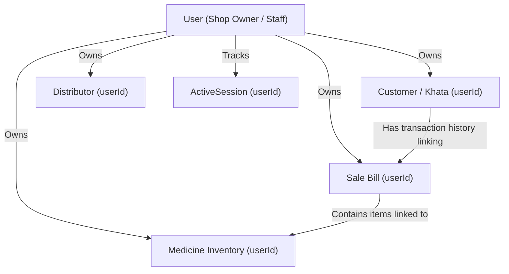

# 01. Database Models & Schema Study

Is document me hum Medical ERP ke sabhi database models (MongoDB & Mongoose schemas) ko bahut aasan aur detail me samjhenge. Agar aap database ya backend me naye hain, toh fikar mat kijiye—hum bilkul basic se shuru karenge!

---

## 🧭 Basic Concepts: MongoDB aur Mongoose Kya Hain?

Pehle hum aasan shabdon me samajhte hain ki hum database kaise manage kar rahe hain.

### 1. Database, Collection aur Document kya hote hain?
* **Database (DB)**: Jaise ek badi almirah (cupboard). Iske andar saara data store hota hai.
* **Collection**: Almirah ke alag-alag drawers (jaise Users drawer, Medicines drawer, Sales drawer). SQL databases me inhe "Tables" bola jata hai.
* **Document**: Drawer ke andar rakhi hui single file ya parchi. Jaise ek user ki details, ya ek medicine ki details. SQL me ise "Row" ya "Record" bola jata hai.

### 2. Mongoose kya hai?
MongoDB ek **NoSQL** database hai. Iska matlab hai ki MongoDB khud se koi strict rule nahi lagata ki kis document me kaunsa data hona chahiye (yeh schema-less hota hai). 
Lekin real application me hum chahte hain ki:
* User ka email compulsory ho.
* Quantity kabhi minus (`-`) me na jaye.
* Har entry ke sath automatic date aur time save ho.

In strict rules ko enforce karne ke liye hum **Mongoose** library ka use karte hain. Mongoose JavaScript code aur MongoDB ke beech ek gatekeeper ka kaam karta hai.

---

## 🛠️ Important Mongoose Keywords (Jo baar-baar use honge)

| Keyword | Matlab / Kyu use karte hain? |
| :--- | :--- |
| **`Schema`** | Yeh ek layout ya blueprint (naksha) hota hai jo batata hai ki ek database document me kaun-kaun se fields (jaise name, age, email) honge aur unka data-type kya hoga. |
| **`Model`** | Schema ko use karke database se data lane, save karne ya delete karne ke liye hum jo function/object banate hain use Model kehte hain. |
| **`required: true`** | Yeh field fill karna bilkul mandatory (jaruri) hai. Iske bina data save nahi hoga. |
| **`unique: true`** | Database me is field ki value repeat nahi ho sakti (jaise username ya email). |
| **`trim: true`** | Data save karne se pehle extra spaces (aage aur peeche ke gaps) ko auto-remove kar deta hai. (Example: `" Dolo "` ban jayega `"Dolo"`). |
| **`lowercase: true`** | Text ko automatic small letters me convert kar deta hai (jaise Email check ke liye helpful hai). |
| **`enum: [...]`** | Is field ki value sirf unhi options me se ho sakti hai jo array ke andar diye gaye hain. (Example: role can be only `admin` or `staff`). |
| **`default: value`** | Agar user koi value na de, toh automatic yeh default value store ho jayegi. |
| **`timestamps: true`** | Mongoose har document me do fields automatic add kar dega: `createdAt` (kab bana) aur `updatedAt` (kab edit hua). |
| **`versionKey: false`** | MongoDB document me ek default field banta hai `__v` (version key). `versionKey: false` karne se yeh disable ho jata hai taaki data clean rahe. |
| **`ref` & `ObjectId`** | Ek document ko dusre document se link (connect) karne ke liye. Jaise `userId` me User table ki dynamic unique ID store karna. |

---

## 🔄 Next.js Model Hot-Reload Prevention Pattern

Aapko har file ke end me yeh line dikhegi:
```javascript
export default mongoose.models.User || mongoose.model("User", UserSchema);
```
**Yeh kyu kiya hai? (Concept)**
Next.js me jab bhi hum code change karte hain, toh Next.js use server par **Hot-Reload** (restart) karta hai. 
* Agar hum simple `mongoose.model("User", UserSchema)` likhte, toh har reload par Mongoose naya model create karne ki koshish karta aur error deta: `OverwriteModelError: Cannot overwrite model once compiled`.
* `mongoose.models.User || ...` ka matlab hai: "Agar 'User' model pehle se memory me compiled hai, toh usi ko use karo (left side), nahi toh naya compile karo (right side)."

---

## 🗂️ Detailed Study of Each Model (7 Files)

### 1. User Model (`src/models/User.js`)
* **Path**: [User.js](file:///d:/Working%20Client/medical-erp/src/models/User.js)
* **Purpose**: ERP system me registration karne wale owners/pharmacies, employees aur super-admin ki details rakhne ke liye.

#### Code Analysis:
```javascript
import mongoose from "mongoose";

const UserSchema = new mongoose.Schema({
  username: { 
    type: String, 
    required: true, 
    unique: true 
  },
  password: { 
    type: String, 
    required: true 
  },
  name: { type: String, trim: true },
  shopName: { type: String, trim: true },
  address: { type: String, trim: true },
  phoneNumber: { type: String, trim: true },
  email: { type: String, trim: true, lowercase: true },
  role: { 
    type: String, 
    enum: ['superadmin', 'admin', 'staff'], 
    default: 'admin' // default is 'admin' (pharmacy owner)
  },
  status: {
    type: String,
    enum: ['active', 'disabled'],
    default: 'active'
  },
  // LICENSING / SUBSCRIPTION SYSTEM
  subscriptionEnd: {
    type: Date,
    default: () => {
      // Jab naya user register hoga, use automatic 7-day ka free trial milega
      const d = new Date();
      d.setDate(d.getDate() + 7);
      return d;
    }
  },
  // Pure subscription logs
  subscriptionHistory: [{
    addedMonths: { type: Number, required: true },
    addedAt: { type: Date, default: Date.now },
    newExpirationDate: { type: Date, required: true }
  }],
  // GDPR/Legal compliance fields (Term & condition details)
  termsAccepted: { type: Boolean, default: false },
  termsVersion: { type: String, default: "v1.0" },
  consentTimestamp: { type: Date },
  consentIP: { type: String }
}, { timestamps: true });

// INDEXES for fast searches (User login aur search me speed badhane ke liye)
UserSchema.index({ username: 1 });
UserSchema.index({ name: 1 });
UserSchema.index({ shopName: 1 });
UserSchema.index({ phoneNumber: 1 });
UserSchema.index({ email: 1 });
```

* **Important Logic**:
  * `subscriptionEnd` me ek dynamic function run hota hai jo current date me 7 days add kar deta hai registration ke waqt.
  * `subscriptionHistory` ek array of objects hai. Jab bhi superadmin license extend karega, yaha entry save hogi (audit log).
  * `index` queries ko fast karta hai. `1` ka matlab ascending order index hai.

---

### 2. Active Session Model (`src/models/ActiveSession.js`)
* **Path**: [ActiveSession.js](file:///d:/Working%20Client/medical-erp/src/models/ActiveSession.js)
* **Purpose**: Security ke liye. Kaunsa user kis browser, device aur IP address se logged-in hai usko track karne aur multi-device logins control karne ke liye.

#### Code Analysis:
```javascript
const ActiveSessionSchema = new mongoose.Schema({
  userId: { 
    type: mongoose.Schema.Types.ObjectId, 
    ref: 'User', // User collection ki ID se linked hai
    required: true 
  },
  deviceSessionId: { type: String, required: true }, // Unique session string
  ipAddress: { type: String },
  userAgentRaw: { type: String }, // Browser ka raw header details
  os: { type: String, default: "Unknown OS" },
  browser: { type: String, default: "Unknown Browser" },
  deviceType: { type: String, default: "Desktop" },
  lastActive: { type: Date, default: Date.now }, // Auto updates on API access
  status: { type: String, enum: ['active', 'revoked'], default: 'active' }
}, { 
  timestamps: true,
  versionKey: false
});

ActiveSessionSchema.index({ userId: 1 });
// Compound Index: Ek user ke paas ek device session ID unique honi chahiye
ActiveSessionSchema.index({ userId: 1, deviceSessionId: 1 }, { unique: true });
ActiveSessionSchema.index({ lastActive: -1 });
```

* **Important Logic**:
  * **Compound Index**: `{ userId: 1, deviceSessionId: 1 }` ensure karta hai ki ek user ke paas ek specific browser session unique ho. Agar duplicate session aayega toh database save hone se mana kar dega.

---

### 3. OTP Model (`src/models/Otp.js`)
* **Path**: [Otp.js](file:///d:/Working%20Client/medical-erp/src/models/Otp.js)
* **Purpose**: Verification codes (OTP) ko temporary store karne ke liye (Sign-up ya password reset ke liye).

#### Code Analysis:
```javascript
const OtpSchema = new mongoose.Schema({
  email: { type: String, required: true, trim: true, lowercase: true },
  phone: { type: String, trim: true },
  emailOtp: { type: String, required: true },
  phoneOtp: { type: String, required: true },
  createdAt: { 
    type: Date, 
    default: Date.now, 
    expires: 600 // TTL Index (Time-To-Live)
  }
}, {
  versionKey: false
});
```

* **Important Logic**:
  * **TTL Index (`expires: 600`)**: Yeh MongoDB ka ek kamaal ka feature hai. `expires: 600` ka matlab hai ki jaise hi OTP document banega, theek 10 minutes (600 seconds) baad MongoDB background me is file ko automatic **delete** kar dega. Isse database clean rehta hai aur expired OTP automatically expire ho jate hain hacker verification se bachne ke liye.

---

### 4. Customer Model (`src/models/Customer.js`)
* **Path**: [Customer.js](file:///d:/Working%20Client/medical-erp/src/models/Customer.js)
* **Purpose**: Udhaari/Credit ledger management (Khata system). Kaunse customer ne kitni medicine udhaar li, kab payment ki, unka balance aur credit limit check karne ke liye.

#### Code Analysis:
```javascript
// Customer ke under transaction logs save karne ka template (Sub-schema)
const CustomerTransactionSchema = new mongoose.Schema({
  type: { type: String, enum: ['Sale', 'Payment', 'Debt'], required: true },
  amount: { type: Number, required: true },
  date: { type: Date, default: Date.now },
  saleId: { type: mongoose.Schema.Types.ObjectId, ref: 'Sale' }, // Linked to Sales Invoice
  note: { type: String, default: "" }
}, { _id: false }); // _id false taki subschema ka faltu auto-id generate na ho

const CustomerSchema = new mongoose.Schema({
  name: { type: String, required: [true, "Customer name is required"], trim: true },
  phone: { type: String, required: [true, "Customer phone is required"], trim: true },
  userId: { type: mongoose.Schema.Types.ObjectId, ref: 'User', required: true }, // Jis pharmacy shop ka customer hai
  balance: { type: Number, default: 0 }, // positive balance matlab customer ko paise dene hain (Udhaar)
  creditLimit: { type: Number, default: 10000 }, // Max limit of udhaari (Rs)
  promiseDate: { type: Date, default: null }, // Kab paise wapas karne ka waada kiya hai
  transactions: [CustomerTransactionSchema] // Subschema array (logs)
}, { 
  timestamps: true, 
  versionKey: false 
});

// Composite Index: Phone numbers must be unique PER pharmacy shop (userId)
CustomerSchema.index({ userId: 1, phone: 1 }, { unique: true });
CustomerSchema.index({ userId: 1, name: 1 });
```

* **Important Logic**:
  * **Nested/Sub Schema (`transactions: [CustomerTransactionSchema]`)**: Customer ki saari transaction histories (kab sale hui, kab cash return kiya) customer document ke andar hi store hoti hain.
  * **Unique Compound Index `{ userId: 1, phone: 1 }`**: Ek hi phone number ke do customer same shop me nahi ho sakte. Par do alag-alag pharmacy shops (different `userId`) me same number wale customer ho sakte hain. Isliye single phone index unique na karke compound level unique banaya gaya.

---

### 5. Distributor Model (`src/models/Distributor.js`)
* **Path**: [Distributor.js](file:///d:/Working%20Client/medical-erp/src/models/Distributor.js)
* **Purpose**: Supplier/Distributor ki information save karne ke liye jinse dukandar wholesale me medicines purchase karta hai.

#### Code Analysis:
```javascript
const DistributorSchema = new mongoose.Schema({
  name: { type: String, required: true, trim: true },
  phone: { type: String, default: "" },
  address: { type: String, default: "" },
  userId: { type: mongoose.Schema.Types.ObjectId, ref: 'User', required: true } // Kis shop ka distributor hai
}, {
  timestamps: true,
  versionKey: false
});

// Distributor name should be unique for that specific shop user
DistributorSchema.index({ userId: 1, name: 1 }, { unique: true });
```

* **Important Logic**:
  * Shop-based unique separation: Same distributor name doosri shop ke under ban sakta hai, par aapki shop ke under same name dobara generate nahi ho sakta.

---

### 6. Medicine Model (`src/models/Medicine.js`)
* **Path**: [Medicine.js](file:///d:/Working%20Client/medical-erp/src/models/Medicine.js)
* **Purpose**: Stock and Inventory Management. Kis batch number ki medicine kab expire ho rahi hai, kitna MRP hai, aur kitni quantity bachi hai.

#### Code Analysis:
```javascript
const MedicineSchema = new mongoose.Schema({
    name: { type: String, required: [true, "Medicine name is required"], trim: true },
    batch: { type: String, required: [true, "Batch number is required"], trim: true },
    expiryDate: { type: Date, required: [true, "Expiry date is required"] },
    quantity: { 
      type: Number, 
      required: [true, "Quantity is required"], 
      min: [0, "Quantity cannot be less than 0"] // negative quantity prevention
    },
    mrp: { type: Number, required: [true, "MRP is required"] },
    purchasePrice: { type: Number, required: [true, "Purchase Price is required"], default: 0 },
    distributor: { type: String, required: true, trim: true },
    billNumber: { type: String, required: [true, "Bill number is required"], trim: true },
    purchaseDate: { type: Date, required: [true, "Purchase date is required"] },
    barcodeId: { type: String, unique: true, required: true, trim: true }, // Quick barcode scanning
    userId: { type: mongoose.Schema.Types.ObjectId, ref: 'User', required: true },
}, { 
    timestamps: true, 
    versionKey: false 
});

// 🚀 ENTERPRISE SPEED OPTIMIZATION INDEXES (Lakhs of data search handling)
MedicineSchema.index({ userId: 1 });
MedicineSchema.index({ userId: 1, createdAt: -1 });
MedicineSchema.index({ userId: 1, quantity: 1 });
MedicineSchema.index({ userId: 1, expiryDate: 1, quantity: 1 }); // Expired and out of stock check
MedicineSchema.index({ userId: 1, name: 1 });
MedicineSchema.index({ userId: 1, barcodeId: 1 });
MedicineSchema.index({ userId: 1, batch: 1 });
// Single indexes for global admin search
MedicineSchema.index({ name: 1 }); 
MedicineSchema.index({ barcodeId: 1 });
```

* **Important Logic**:
  * **Min Validation**: `min: [0, "Quantity cannot be less than 0"]` ensure karta hai ki billing ke time pe agar backend deduction logic check na bhi kare, toh database negative stock entry accept nahi karega.
  * **Enterprise Indexing**: Yaha index arrays bahut saare hain. Kyu? Kyunki dukan me lakhon medicines ho sakti hain. Jab cashier POS scanner se barcode search karta hai, tab `{ userId: 1, barcodeId: 1 }` index query ko fractions of milliseconds (0.01 sec) me return karta hai, warna database scan slow ho jata.

---

### 7. Sale Model (`src/models/Sale.js`)
* **Path**: [Sale.js](file:///d:/Working%20Client/medical-erp/src/models/Sale.js)
* **Purpose**: POS Billing system. Har ek generated bill, usme bikne wali medicines, tax, discounts aur payment status ko calculate kar ke log record maintain karna.

#### Code Analysis:
```javascript
// Har ek item jo bill me becha gaya (Sub-schema)
const SaleItemSchema = new mongoose.Schema({
  medicineId: { type: mongoose.Schema.Types.ObjectId, ref: 'Medicine', required: true },
  name: { type: String, required: true, trim: true },
  quantity: { type: Number, required: true },
  mrp: { type: Number, required: true },
  purchasePrice: { type: Number, default: 0 }, // isse profit margin calculation aasan hota hai
  total: { type: Number, required: true },
  discountPercent: { type: Number, default: 0 },
  gstPercent: { type: Number, default: 0 },
  taxableAmount: { type: Number, default: 0 },
  cgstAmount: { type: Number, default: 0 },
  sgstAmount: { type: Number, default: 0 }
}, { _id: false }); 

const SaleSchema = new mongoose.Schema({
  items: [SaleItemSchema], // Bill ke saare medicines items list
  totalAmount: { type: Number, required: true },
  paymentMethod: { type: String, enum: ['Cash', 'UPI', 'Card', 'Udhaar'], default: 'Cash' },
  date: { type: Date, default: Date.now },
  userId: { type: mongoose.Schema.Types.ObjectId, ref: 'User', required: true },
  customerName: { type: String, default: "" },
  customerPhone: { type: String, default: "" },
  // SCH-H / Restricted Drugs regulatory compliance details
  prescriptionDetail: {
    doctorName: { type: String, default: "" },
    doctorRegNo: { type: String, default: "" },
    patientAge: { type: Number, default: null },
    patientGender: { type: String, default: "" }
  },
  totalDiscount: { type: Number, default: 0 },
  totalTax: { type: Number, default: 0 }
}, { 
    timestamps: true, 
    versionKey: false 
});

// Speed Indexing for Sales Graphs & Reports
SaleSchema.index({ userId: 1 });
SaleSchema.index({ userId: 1, date: -1 }); // Monthly / Daily sales report fetch speedup
SaleSchema.index({ date: -1 });
SaleSchema.index({ "items.medicineId": 1 }); // Kaunsi medicine sabse zyada bechi gayi analytics ke liye
```

* **Important Logic**:
  * **Tax Split**: Medicine bill me CGST (Central GST) aur SGST (State GST) ka break-up automatic calculate karke save kiya jata hai taaki GST tax returns filings me problem na aaye.
  * **`prescriptionDetail`**: Medical rules ke mutabik restricted (Schedule H/H1) medicines bechte waqt doctor ka registration number aur patient details optional/required capture karni hoti hai.
  * **Nested Indexing**: `SaleSchema.index({ "items.medicineId": 1 })` ka use nested items array ke andar se query search karne ke liye hota hai (jaise analytics me find karna ho ki pure saal me exact 'Dolo 650' kitni bar bechi gayi).

---

## 💡 Summary: Models Ek Dusre Se Kaise Related Hain?

Isko hum is visual flowchart se samajh sakte hain:



1. **`User` (Main Centre)**: Har cheez is user se linked hai. `userId` ke bina koi data isolate nahi ho sakta (Shop A ka data Shop B nahi dekh sakti).
2. **`Sale` & `Medicine` Relation**: Jab koi sale create hoti hai, toh `Sale.items.medicineId` inventory ke `Medicine` se linked hoti hai taaki product detail check ho sake aur inventory deduct ho sake.
3. **`Customer` & `Sale` Relation**: Agar payments ya udhaar ('Udhaar') pe sale hoti hai, toh customer balance automatically increase ho jata hai aur customer ke transaction history log me us sales invoice (`saleId`) ka reference add ho jata hai.
